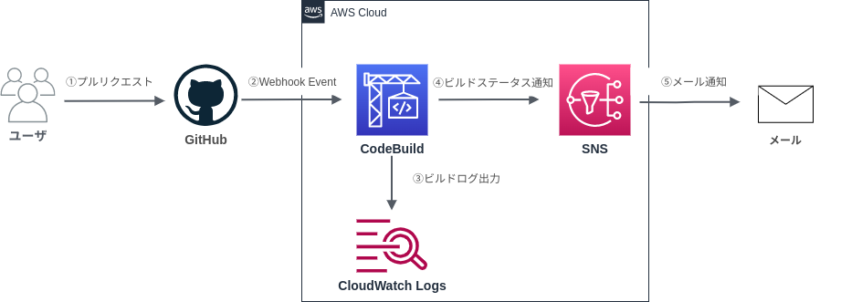

# codebuild-ci
## 概要
CodeBuildとGitHubを連携したCIのサンプルリポジトリです.

## 構成図

1. ユーザがGitHubでプルリクエストを作成する
2. GitHubはCodeBuildにWebhookを通知する
3. CodeBuildがGitHubの対象ブランチのビルドを行い、CloudWatch Logsにビルドログを通知する
4. CodeBuildがSNSにビルドステータスを通知する
5. SNSがユーザのメールアドレスにCodeBuildの処理結果を通知する

## 開発要件
- jq
- git
- aws cli
- docker
- docker-compose

## CI用リソースの展開方法
0. リポジトリをフォークします
1. リポジトリ直下に以下の```config.json```を作成します.
```json
[
  {
    "stack_name": "user-role-codebuild-base",
    "template_file": "./codebuild/codebuild-role.yml",
    "parameters": []
  },
  {
    "stack_name": "user-codebuild-ci-sample",
    "template_file": "./codebuild/codebuild-sns.yml",
    "parameters": [
      {
        "key": "ProjectName",
        "value": "codebuild-ci"
      },
      {
        "key": "GitHubRepository",
        "value": "https://github.com/<GitHubアカウント名>/codebuild-ci"
      },
      {
        "key": "StartBuildPattern",
        "value": "^refs/heads/main$"
      },
      {
        "key": "EmailAddress",
        "value": "<通知先のメールアドレス>"
      }
    ]
  }
]
```
  - ```stack_name```: 作成するCloudFormationスタック名
  - ```template_file```: CloudFormationを記述したYAMLテンプレートのパス
  - ```parameters```: CloudFormationのParametersに記載したパラメータ
2. リポジトリ直下で下記コマンドを入力します
```
bash deploy_cfn.sh config.json deploy
```
